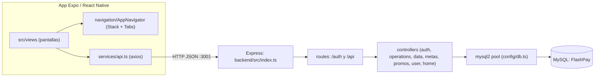
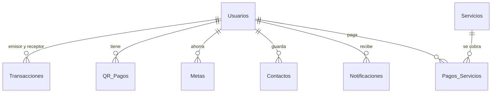

<div align="center">
  
  <h1>FlashPay</h1>
  <p><b>Prototipo de billetera digital móvil (estilo Yape) con app Expo/React Native y API Node + MySQL.</b></p>
  
  
  
  
  
  
  
  <p>
    <a href="#-inicio-rápido">Inicio rápido</a> ·
    <a href="#-características">Características</a> ·
    <a href="#-arquitectura">Arquitectura</a> ·
    <a href="#-pruebas">Pruebas</a> ·
    <a href="#-lo-que-todavía-no-existe">Limitaciones</a>
  </p>
</div>

**FlashPay** es un prototipo académico/demo de billetera digital: la app móvil (Expo + React Native + TypeScript) consume una API Express que guarda usuarios, saldos y movimientos en MySQL. **No es un producto de pagos real**: no hay integración con bancos, pasarelas, redes de tarjetas ni con ningún sistema de QR interbancario; los saldos son números en una tabla local y el "dinero" no sale de tu base de datos.

## 🎬 Vista rápida

No se pudieron generar capturas (requiere MySQL y emulador/Expo Go). Flujo principal de la app:

```text
Bienvenida (onboarding) -> Login (email + contraseña, o biometría si ya hubo sesión)
  -> Inicio: saldo, movimientos recientes, contactos, notificaciones
     -> Transferir (por teléfono / contacto / QR) -> Comprobante
     -> Recarga de celular · Pago de servicios · Depósito
     -> Metas de ahorro (crear y aportar)
  -> Historial · QR (escanear / cobrar) · Promos · Perfil (editar, seguridad, ayuda, soporte)
```

## ✨ Características

| Característica | Detalle (verificado en código) |
|---|---|
| Login | `POST /auth/login` contra la tabla `Usuarios`; el cliente guarda `userToken` y `userData` en AsyncStorage |
| Biometría | `expo-local-authentication` en `PantallaLogin` y `PantallaSeguridad` |
| Transferencias | `POST /api/transfer` por teléfono, con transacción SQL (descuenta, acredita y registra) |
| Recargas y servicios | `POST /api/topup`, `POST /api/services`; catálogo en `GET /api/services` |
| Depósito | `POST /api/deposit` |
| QR | Genera (`react-native-qrcode-svg`), escanea (`expo-camera`) y resuelve con `GET /api/resolve-qr` |
| Metas de ahorro | `GET/POST /api/metas`, `POST /api/metas/add` |
| Contactos, notificaciones, promos | `GET/POST /api/contacts`, `GET /api/notifications`, `GET /api/promos` |
| Perfil y límites | `POST /api/user/update`, `/user/password`, `GET/POST /api/user/limits` |
| Comprobantes | Vista de comprobante; `expo-print`, `expo-sharing` y `react-native-view-shot` en dependencias |
| Documentación | 8 archivos en `docs/` (instalación, configuración, estructura) |

## 🏗️ Arquitectura





## 🚀 Inicio rápido

| Requisito | Versión |
|---|---|
| Node.js | 18+ (según `docs/02_INSTALACION.md`) |
| MySQL | Local (Laragon/XAMPP), puerto 3306 |
| Expo Go o emulador | Para probar la app |

```bash
# 1. Base de datos: crear "FlashPay" y ejecutar los scripts de backend/db/ (ver limitaciones)

# 2. Backend
cd backend
npm install
npm run dev          # http://localhost:3001 (PORT configurable en backend/.env)

# 3. App (en otra terminal, raíz del repo)
npm install
npx expo start
```

Verificado: `npm ci` y `npx tsc --noEmit` del backend terminan sin errores. **No** se ejecutó contra MySQL ni en un dispositivo. La URL de la API está fija en `src/services/api.ts` como `http://localhost:3001`; para un teléfono físico hay que cambiarla por la IP de tu máquina.

<details>
<summary>Estructura de carpetas</summary>

```text
App.tsx, index.ts          # entrada de la app Expo
src/views/                 # autenticacion, inicio, operaciones, metas, perfil, promociones, soporte, contactos
src/components/            # SuccessReceipt, FadeInView, Skeleton
src/navigation/            # AppNavigator (Stack + Bottom Tabs)
src/services/api.ts        # cliente axios
src/utils/                 # theme, haptics, avatarUtils
backend/src/               # index.ts, config/db.ts, routes/, controllers/
backend/db/                # migrations/, seeders/, sql/init.sql, 002/003 sueltos
docs/                      # documentación previa (01..06, especificaciones)
```

</details>

<details>
<summary>Variables de entorno (backend/.env)</summary>

`PORT`, `DB_HOST`, `DB_USER`, `DB_PASSWORD`, `DB_NAME` (por defecto `localhost`, `root`, vacío, `FlashPay`). `backend/.env` ya no se versiona: copia `backend/.env.example` a `backend/.env` y completa los valores.

</details>

## 🧪 Pruebas

El backend tiene tests con Vitest + Supertest (`cd backend && npm test`): hash de contraseñas, JWT, middleware de autenticación y login con hash (base de datos simulada). La app móvil no tiene tests.

## 🔒 Seguridad

Estado real, **no apto para producción**:

- Login con bcrypt (upgrade-on-login para cuentas antiguas en texto plano) y JWT HS256 firmado con `JWT_SECRET` (obligatorio en producción). Todas las rutas `/api` exigen `Authorization: Bearer <token>` y el usuario sale del token, no del cuerpo. Los montos deben ser positivos.
- Sigue pendiente: `cors()` abierto, sin límite de intentos de login, sin revocación de tokens.
- Los usuarios sembrados traen hashes de relleno, no contraseñas reales.
- Positivo: transferencias, recargas y pagos usan transacciones SQL y consultas parametrizadas.

## 🚧 Lo que todavía no existe

- Integración bancaria, pasarela de pagos, QR interoperable o cualquier movimiento de dinero real.
- Sin tests de la app, sin CI, sin despliegue, sin capturas.

## 📄 Licencia

[MIT](LICENSE).

<div align="center"><sub>Hecho por Luiss2080 · FlashPay, prototipo de billetera digital</sub></div>
